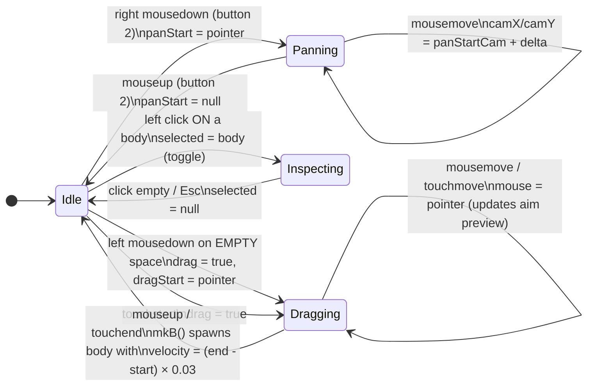
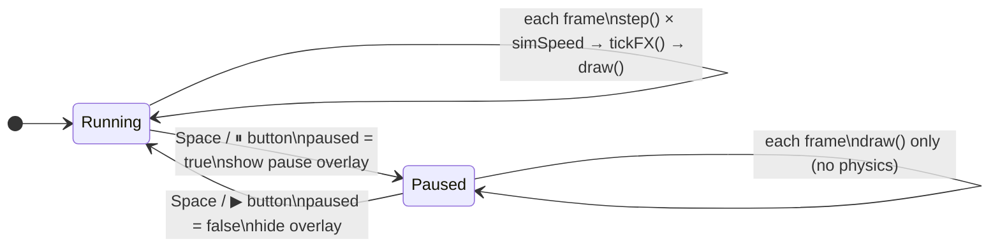
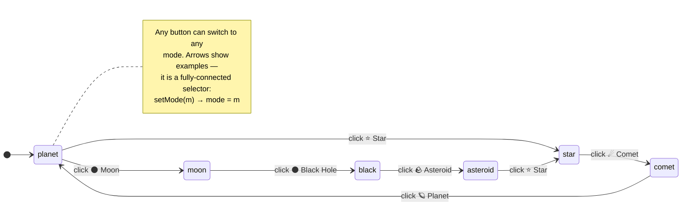

# 🤖 Automata & State Machines — Gravity Simulator

This document collects **every finite-state machine (FSM / "automaton")** that
drives the simulator, drawn as graphs. Each one is taken directly from the code,
with the source file noted so you can verify it.

> A *finite-state machine* is a system that is always in exactly **one state**,
> and moves between states only on specific **events/transitions**.

**Contents**
1. [Pointer / Interaction FSM](#1-pointer--interaction-fsm) — `controls.js`
2. [Simulation Run-State FSM](#2-simulation-run-state-fsm) — `controls.js` / `main.js`
3. [Body-Type Mode Selector](#3-body-type-mode-selector) — `controls.js`
4. [Body Lifecycle FSM](#4-body-lifecycle-fsm) — `physics.js` / `effects.js`
5. [App Bootstrap FSM](#5-app-bootstrap-fsm) — `main.js`
6. [State Variable Reference](#6-state-variable-reference) — `state.js`

---

## 1. Pointer / Interaction FSM

How the program reacts to the mouse/touch. It is always in one of three states:
**Idle**, **Dragging** (aiming a new body), or **Panning** (moving the camera).
The relevant flags live in `state.js` (`drag`, `panStart`, `selected`).

**Key transitions (from `controls.js`):**

| From | Event | To | Action |
|---|---|---|---|
| Idle | right `mousedown` | Panning | store `panStart`, `panStartCam` |
| Panning | `mousemove` | Panning | update `camX`, `camY` |
| Panning | right `mouseup` | Idle | clear `panStart` |
| Idle | left click on body | Inspecting | `selected = hit` (toggle) |
| Idle | left `mousedown` empty | Dragging | `drag = true` |
| Dragging | `mouseup` / `touchend` | Idle | `bodies.push(mkB(...))` |
| any | `Esc` | Idle | `selected = null` |

---

## 2. Simulation Run-State FSM

The physics either advances or it is frozen. Toggled by **Space** or the
**Pause** button (`togglePause()` in `controls.js`). Read by `loop()` in `main.js`.

> Note the *self-loops*: in **Running** every animation frame runs physics +
> effects + render; in **Paused** the frame still renders (so you can still pan
> and inspect) but skips `step()` and `tickFX()`.

---

## 3. Body-Type Mode Selector

Which kind of body the next drag will create. Six mutually-exclusive states;
`setMode()` switches between them and highlights the matching toolbar button.
The current state is the `mode` variable in `state.js` (default `'planet'`).

---

## 4. Body Lifecycle FSM

What happens to a single celestial body from spawn to removal. This is the
"physics" automaton, evaluated inside `step()` (`physics.js`) every tick.
*(Also summarised in the main README.)*

```mermaid
stateDiagram-v2
    direction LR
    [*] --> Alive : mkB() — spawn\nassign visual + trail ring-buffer

    Alive --> Alive : every tick\ngravity accumulates accel\nx,y += vx,vy ; age++ ; pushTrail()

    Alive --> Bouncing : bounceOn AND hits wall
    Bouncing --> Alive : reflect vx/vy × 0.75 damping\nspawn spark particles

    Alive --> Merging : overlap with normal body\n(d < r1+r2, no black hole)
    Merging --> Alive : larger body survives\nmomentum conserved\nr = cbrt(r1³+r2³)
    Merging --> [*] : smaller body removed\nmerges++ ; spawn nebula

    Alive --> Swallowed : distance < blackHole.radius
    Swallowed --> [*] : body removed\nswallowed++ ; purple vortex FX
```

---

## 5. App Bootstrap FSM

Startup deals with one tricky case: the browser may not have sized the canvas
container yet. `init()` (`main.js`) loops on `requestAnimationFrame` until the
viewport has a real size, *then* starts the simulation exactly once
(`started` flag guards against double-start).

```mermaid
stateDiagram-v2
    direction LR
    [*] --> LayoutPending : requestAnimationFrame(init)

    LayoutPending --> LayoutPending : W==0 or H==0\ntry again next frame
    LayoutPending --> Initialised : canvas has size\nresize() ; loadDemo('solar')
    Initialised --> Running : started = true\nrequestAnimationFrame(loop)
    Running --> [*]
```

---

## 6. State Variable Reference

Every flag above is a plain global in **`state.js`** — the FSMs are implemented
as ordinary variables rather than a formal library:

| Variable | FSM it belongs to | Meaning |
|---|---|---|
| `drag`, `dragStart`, `mouse` | Pointer FSM | true while aiming a new body |
| `panStart`, `panStartCam` | Pointer FSM | active right-drag camera pan |
| `selected` | Pointer FSM | currently inspected body (or `null`) |
| `paused` | Run-State FSM | physics frozen / running |
| `simSpeed` | Run-State FSM | physics steps per frame (1–4) |
| `mode` | Mode Selector | next body type to spawn |
| `bounceOn` | Body Lifecycle | walls reflect bodies |
| `started` | Bootstrap FSM | guards single loop start |

---

### How to read these diagrams

- **Rounded `[*]`** = start / end (creation or destruction).
- **Boxes** = states (the program is in exactly one per machine at a time).
- **Arrows** = transitions, labelled with the **event** and the **action** taken.
- **Self-loops** (arrow back to same box) = something that happens repeatedly
  while staying in that state (e.g. gravity each tick).

All diagrams use **Mermaid**, which GitHub renders automatically in Markdown.
