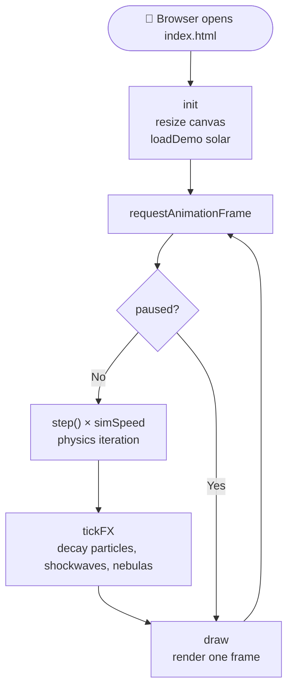
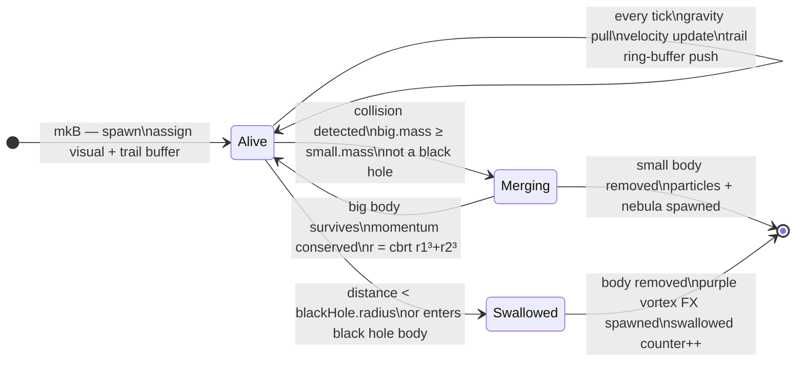
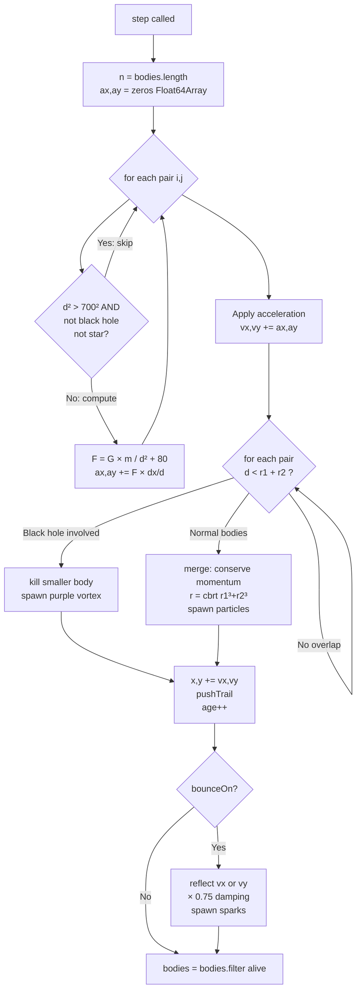
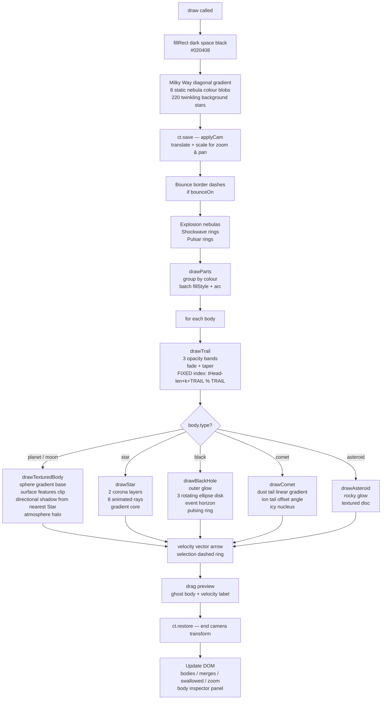

# 🌌 Gravity Simulator

> A real-time N-body gravitational physics simulation built entirely with **vanilla HTML5 Canvas**, **JavaScript**, and **CSS** — no libraries, no frameworks.


---

## 📖 Table of Contents

1. [Features](#-features)
2. [How to Run](#-how-to-run)
3. [Controls](#-controls)
4. [Physics Explained](#-physics-explained)
5. [Code Architecture](#-code-architecture)
   - [File Structure](#file-structure)
   - [Main Animation Loop](#main-animation-loop)
   - [Body Lifecycle](#body-lifecycle-state-machine)
   - [Physics Pipeline](#physics-pipeline)
   - [Rendering Pipeline](#rendering-pipeline)
6. [Body Types](#-body-types)
7. [Planet Visual Types](#-planet-visual-types)
8. [Technologies](#-technologies)

---

## ✨ Features

| Category | What it does |
|---|---|
| **Physics** | Full Newton N-body gravity, conservation of momentum on merges, wall bounce with damping |
| **Bodies** | 6 types — Planet, Moon, Star, Black Hole, Comet, Asteroid |
| **Planets** | 5 procedurally generated visual types (oceanic, rocky, desert, ice, gas giant) |
| **Lighting** | Directional shadow per planet calculated from the nearest Star each frame |
| **Black Hole** | Rotating accretion disk (3 ellipse layers), outer glow, pulsing photon ring |
| **Star** | Animated 8-ray corona, layered glow, gradient core |
| **Comet** | Dust tail + separate ion tail, both opposing the velocity vector |
| **Camera** | Scroll-wheel zoom (0.12× – 10×) centred on the cursor; right-drag pan |
| **Inspector** | Click any body to see its live mass, speed, radius, and age |
| **Demos** | 4 pre-built scenes: Solar System, Binary Black Holes, Star Cluster, Galaxy Collision |
| **FX** | Particles, shockwave rings, explosion nebulas — all colour-batched for performance |

---

## 🚀 How to Run

No build tools, no server required.

```
1. Download or clone the repository
2. Open index.html in any modern browser (Chrome, Firefox, Edge, Safari)
```

> **Tip:** For the best experience use a Chromium-based browser (Chrome / Edge) on a desktop with hardware acceleration enabled.

---

## 🎮 Controls

| Action | How |
|---|---|
| **Launch a body** | Left-click and drag on empty space — drag length sets initial velocity |
| **Inspect a body** | Left-click on any existing body |
| **Deselect** | `Esc` |
| **Pan camera** | Right-click drag |
| **Zoom** | Mouse scroll wheel (zooms toward cursor) |
| **Reset camera** | `R` |
| **Pause / Resume** | `Space` or ⏸ button |
| **Toggle bounce walls** | ⬜ Bounce button |
| **Toggle velocity vectors** | → Vectors button |
| **Change simulation speed** | Speed slider (1× – 4×) |
| **Load demo scene** | Demo ▾ dropdown |
| **Physics reference** | Math ↗ button |

---

## 🔬 Physics Explained

### Newton's Law of Universal Gravitation

Every body in the simulation attracts every other body with a force:

```
F = G × m₁ × m₂ / d²
```

| Symbol | Meaning |
|---|---|
| `G` | Gravitational constant — set to **0.5** (scaled for the simulation) |
| `m₁`, `m₂` | Masses of the two bodies |
| `d²` | Squared distance between their centres |
| `+80` | **Softening factor** — prevents infinite force when two bodies nearly overlap |

### Euler Integration

Each physics tick, acceleration is accumulated and applied:

```
ax += G × mⱼ / (d² + 80) × (dx / d)   ← directional acceleration from body j
vx += ax                                 ← velocity from acceleration
x  += vx                                 ← position  from velocity
```

This is **Symplectic Euler integration** — simple, stable, and energy-conserving enough for a real-time simulation.

### Conservation of Momentum (Merge)

When two non-black-hole bodies overlap, the larger absorbs the smaller:

```
vx_new = (vx₁ × m₁  +  vx₂ × m₂) / (m₁ + m₂)   ← weighted average velocity

r_new  = ∛(r₁³ + r₂³)                              ← volume is conserved
```

### Wall Bounce

When bounce is enabled, bodies reflect off the viewport edges with a **0.75 damping coefficient** (energy loss per bounce simulates inelastic collision with a wall).

---

## 🏗️ Code Architecture

### File Structure

```
Gravity Simulator/
│
├── index.html          ← HTML shell: layout, toolbar, overlays, script tags
├── README.md           ← This file
│
├── css/
│   └── styles.css      ← All visual styling (glassmorphism UI, canvas overlays)
│
└── js/
    ├── constants.js    ← G, TRAIL, TY body-types, 5 planet visual schemes
    ├── state.js        ← All mutable global variables (bodies, particles, camera...)
    ├── camera.js       ← Zoom & pan: s2w(), applyCam()
    ├── bodies.js       ← mkB() factory, assignViz() visual generator, hx() util
    ├── effects.js      ← spP/spS/spN spawners, kill(), tickFX(), pushTrail()
    ├── physics.js      ← step() — gravity, collision, movement (O(n²))
    ├── render.js       ← draw() and all drawBody* functions
    ├── demo.js         ← clearAll(), loadDemo() — 4 pre-built scenes
    ├── controls.js     ← All UI event listeners (mouse, touch, keyboard, buttons)
    └── main.js         ← resize(), loop(), init() — entry point
```

> Scripts are loaded with plain `<script src="...">` tags at the bottom of `<body>`.  
> All files share the same global scope — no bundler or module system needed.

---

### Main Animation Loop



---

### Body Lifecycle State Machine



> 📊 This is one of **five** state machines in the project. See
> **[AUTOMATA.md](AUTOMATA.md)** for all of them — pointer/interaction,
> simulation run-state, body-type selector, body lifecycle, and app bootstrap.

---

### Physics Pipeline



---

### Rendering Pipeline



---

## 🪐 Body Types

| Type | Mass | Base Radius | Gravity Range | Special Behaviour |
|---|---|---|---|---|
| 🪐 Planet | 150 | 10 px | 700 px | 5 procedural visual variants |
| 🌑 Moon | 20 | 5 px | 700 px | Crater texture |
| ⭐ Star | 800 | 14 px | **Unlimited** | Illuminates nearby planets; supernova on merge |
| ⚫ Black Hole | 6000 | 17 px | **Unlimited** | Swallows anything it touches; accretion disk |
| ☄ Comet | 60 | 6 px | 700 px | Dual directional tail (dust + ion) |
| 🪨 Asteroid | 35 | 5 px | 700 px | Rocky texture, faint glow |

---

## 🌍 Planet Visual Types

| # | Name | Inspired By | Features |
|---|---|---|---|
| 0 | **Oceanic** | Earth | Blue ocean, green continents, polar ice caps, clouds |
| 1 | **Rocky** | Mars | Red-brown surface, impact craters (double-circle technique) |
| 2 | **Desert** | Venus | Orange-yellow, thick horizontal cloud bands |
| 3 | **Ice** | Europa / Pluto | Pale blue-white, subsurface cracks, central bright spot |
| 4 | **Gas Giant** | Jupiter | 5 horizontal colour bands, Great Red Spot analogue |

Each variant is **generated once at spawn** using `Math.random()` and stored as an array of feature descriptors (`vizFeatures`). This means no random calls happen during drawing — consistent every frame, and cheap to render.

---

## 🛠️ Technologies

| Technology | Used For |
|---|---|
| **HTML5 `<canvas>` 2D API** | All rendering — arcs, gradients, ellipses, clipping masks |
| **`requestAnimationFrame`** | 60 fps animation loop synced to the display refresh rate |
| **`Float32Array` / `Float64Array`** | Typed arrays for trail ring-buffers and acceleration accumulators — faster than plain JS arrays for numeric workloads |
| **CSS backdrop-filter** | Glassmorphism blur effect on toolbar and overlay panels |
| **CSS custom properties (`var()`)** | Per-button accent colours without duplicating CSS rules |
| **Vanilla JavaScript (ES6+)** | Arrow functions, destructuring, `const`/`let`, template literals |

---

## 📁 Why Multiple Files?

The project is split into **10 focused JavaScript modules** so that:

- Each file has a **single responsibility** (physics, rendering, controls…)
- A teacher or code reviewer can navigate directly to the relevant section
- Changes to one system (e.g. the camera) never require touching unrelated code
- The physics logic (`physics.js`) can be read and understood independently

All files share the same browser global scope via plain `<script>` tags — no bundler, no `import/export`, no Node.js required.

---

## 👨‍🎓 Author

**Hristo** — School project, 2025/2026  
GitHub: [github.com/Hristza/Star-System](https://github.com/Hristza/Star-System)
